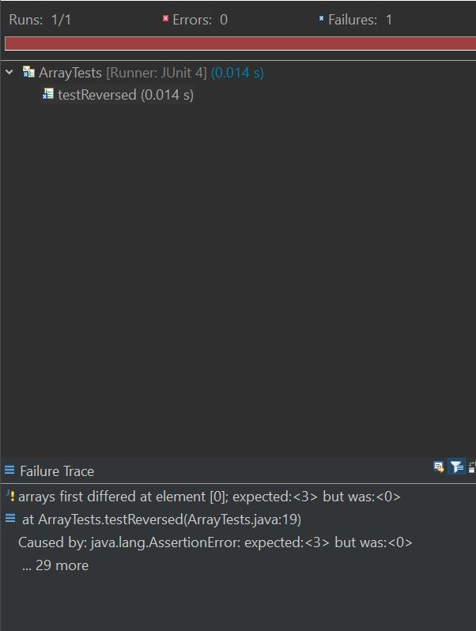
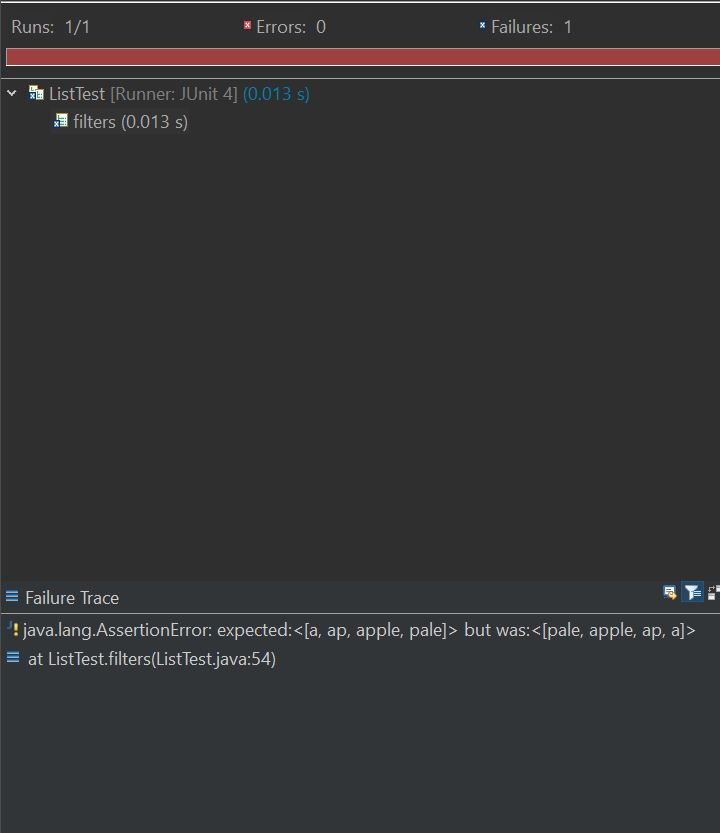

# Lab 3 Report
## Part 2
Choose two of the bugs from different files above. For each, show:
1. The failure-inducing input (the code of the test)

2. The symptom (the failing test output)

3. The bug (the code fix needed)

4. Then, explain the connection between the symptom and the bug. Why does the bug cause that particular symptom for that particular input?

1st Code:

```
  static void reverseInPlace(int[] arr) {
    for(int i = 0; i < arr.length; i += 1) {
      arr[i] = arr[arr.length - i - 1];
    }
  }

  // Returns a *new* array with all the elements of the input array in reversed
  // order
  static int[] reversed(int[] arr) {
    int[] newArray = new int[arr.length];
    
    for(int i = 0; i < arr.length; i += 1) {
      arr[i] = newArray[arr.length - i - 1];
    }
        
    return arr;
  }
```

1. failure inducing input:
```
int[] input1 = {1,2,3};
```
2. Symptom:


3. bug:
```
    for(int i = 0; i < arr.length; i += 1) {
      arr[i] = newArray[arr.length - i - 1];
    }
        
    return arr;
```
4. The code is accessing the wrong element for each iteration of the for loop and therefore will return the wrong result.

2nd code:
```
class ListExamples {

  // Returns a new list that has all the elements of the input list for which
  // the StringChecker returns true, and not the elements that return false, in
  // the same order they appeared in the input list;
  static List<String> filter(List<String> list, StringChecker sc) { 
    List<String> result = new ArrayList<>();
    for(String s: list) {
      if(sc.checkString(s)) {
        result.add(0, s);
      }
    }
    return result;
  }
```
1. failure inducing input
```
		List<String> myList = new ArrayList<>();
		myList.add("a");
		myList.add("b");
		myList.add("k");
		myList.add("ap");
		myList.add("apple");
		myList.add("pale");
```
2. Symptom:


3. bug:
```
result.add(0, s);
```
4. This line of code adds string s at the beginning of the list and shifts the rest of the element to  the right which gives the reverse order of the of the original list. 

